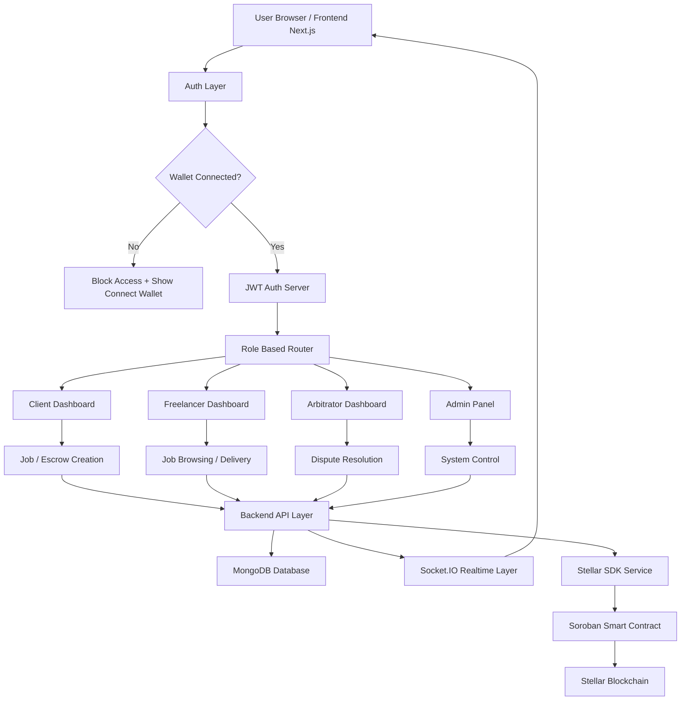
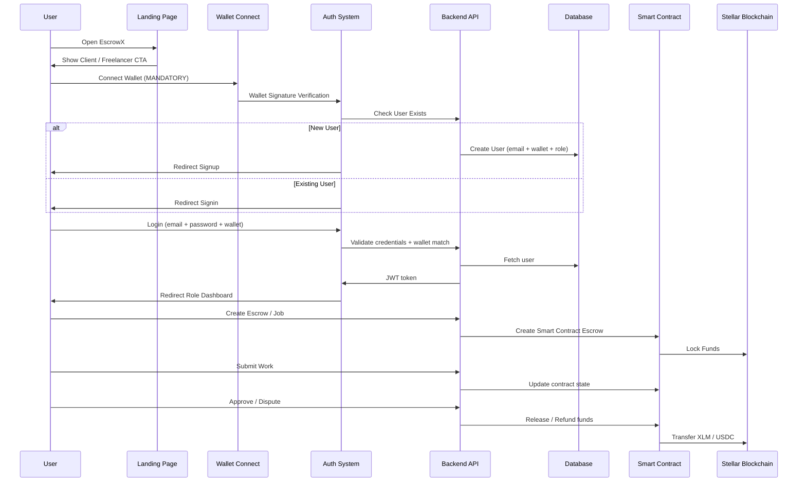
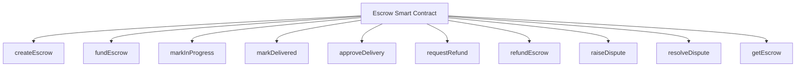

<div align="center">

# 🔐 EscrowX
### Decentralized Freelance Escrow Marketplace on Stellar
*Trustless hiring, milestone-based delivery, and secure fund locking between clients and freelancers.*


</div>

---

## 🌟 What is EscrowX?

EscrowX is a **Web3 freelance marketplace system** where:

- Clients **MUST** fund escrow before publishing a job
- Freelancers work only on **funded projects**
- Funds are **locked inside smart contracts** (not platform wallets)
- Payment is released **ONLY** after client approval

> 👉 This removes scams, chargebacks, and trust issues in freelancing.

---

## ⚠️ Current Problem (Real World)

Traditional platforms like Fiverr / Upwork:

- Client can cancel after receiving work
- Freelancer can be scammed
- Platform controls funds (centralized risk)
- No real ownership or transparency

---

## 💡 EscrowX Solution

EscrowX solves one of the biggest problems in freelancing: **trust**.

Clients often fear paying before receiving quality work, while freelancers fear completing work without getting paid. EscrowX eliminates this trust gap by locking funds inside a **Soroban Smart Contract** before work begins. The payment remains securely locked on-chain until the client approves the delivery or requests a refund, ensuring a transparent, secure, and decentralized workflow for both parties.

---

## 🧠 Real World Example

> 👉 John hires a designer

| System | Flow | Result |
|---|---|---|
| ❌ Old System | John receives logo → refuses payment | Scam |
| ✅ EscrowX | John funds escrow → locked until approval | Safe |

---
## 🏆 Stellar Journey to Master
## 🧭 Belt System Progress
 
| Level | Belt | Focus | Status |
|-------|------|-------|--------|
| ⚪️ Level 1 | White Belt | Wallets & transactions | ✅ Completed |
| 🟡 Level 2 | Yellow Belt | Multi-wallet, contracts & events | ✅ Completed |
| 🟠 Level 3 | Orange Belt | Mini dApp + tests | ✅ Completed |
| 🟢 Level 4 | Green Belt | Advanced contracts & production readiness | ✅ Completed |
| 🔵 Level 5 | Blue Belt | Real MVP (5+ users) | 🔜 Upcoming |
| ⚫️ Level 6 | Black Belt | Scale + Demo Day readiness | 🔜 Upcoming |
 
---

## 🟢 Current Status: GREEN BELT (Completed)

 ## 📋 Deployed Contract
 
| Property | Value |
|---|---|
| **Contract ID** | `CALCCHS44ZJ6U7CFI2NNRIP6IP63XAMNFTGO4RROBGTBF5L7USASFAL7` |
| **Network** | Stellar Testnet |
| **Explorer** | [View on Stellar.expert](https://stellar.expert/explorer/testnet/contract/CALCCHS44ZJ6U7CFI2NNRIP6IP63XAMNFTGO4RROBGTBF5L7USASFAL7) |

---
## ⚡ Smart Contract Test Flow


---

## ⚙️ Core Smart Contract Functions & Test Cases

| Function | Description |Status|
|---|---|---|
| `create_escrow()` | Create escrow agreement on-chain | ✅ Pass |
| `fund_escrow()` | Lock client funds inside smart contract |✅ Pass |
| `get_escrow()` | Read escrow details and current status |✅ Pass |
| `mark_in_progress()` | Move escrow to IN_PROGRESS |✅ Pass |
| `mark_delivered()` | Mark work as DELIVERED |✅ Pass |
| `approve_delivery()` | Release locked funds to freelancer |✅ Pass |
| `raise_dispute()` | Raise a dispute between parties |✅ Pass |
| `request_refund()` | Client requests refund |✅ Pass |
| `resolve_dispute()` | Admin resolves dispute |✅ Pass |
| `refund_escrow()` | Return locked funds back to client |✅ Pass |

**10/10 Functions Passing on Stellar Testnet** 🚀

---

## 🎯 MVP Status

| Feature | Status |
|---|---|
| Smart Contract | 🟢 Complete |
| Frontend Integration | 🟢 Complete |
| Escrow Lifecycle | 🟢 Complete |
| Delivery Workflow | 🟢 Complete |
| Approval Workflow | 🟢 Complete |
| Refund Workflow | 🟢 Complete |
| Dispute Resolution | 🟢 Complete |
| Blockchain Synchronization | 🟢 Complete |
| Production Ready | 🟢 Complete |

---
## 📸 Demo Screenshots


## Analytics 


---
## 🧠 HIGH LEVEL SYSTEM ARCHITECTURE

---
## 🏗️ USER WORKFLOW ARCHITECT

---
## ⛓ SMART CONTRACT ARCHITECTURE


---

## 💳 Blockchain Integration

✔ Freighter Wallet integration

✔ Wallet transaction signing

✔ On-chain transaction execution

✔ Transaction hash captured

✔ Smart contract invocation

✔ Read-only contract queries

✔ Frontend synchronized with blockchain state

---

## 🖥️ Frontend Integration

✔ React + TypeScript integration

✔ Smart contract service layer

✔ Reusable contract hooks

✔ Escrow status synchronization

✔ Delivery workflow connected

✔ Approval workflow connected

✔ Refund workflow connected

✔ Real-time UI state updates

---

## 🔐 Security

✔ Funds never remain under platform control

✔ Funds locked directly inside Soroban Smart Contract

✔ Blockchain acts as the single source of truth

✔ Escrow lifecycle validation implemented

✔ Invalid state transitions prevented

---

## 🏗 Tech Stack

Frontend
- Vite + TypeScript
- React UI
- Freighter Wallet Integration

Backend
- Node.js + Express
- MongoDB 
- Transaction logging

Blockchain Layer
- Stellar Testnet
- Soroban Smart Contracts

---

## ⛓ SMART CONTRACT (SOROBAN)

Contract ID (Testnet)
UPCOMING / NOT SET YET

---

## ⚙️ Contract Functions

- createEscrow()
- fundEscrow()
- markInProgress()
- markDelivered()
- approveDelivery()
- requestRefund()
- refundEscrow()
- raiseDispute()
- resolveDispute()
- getEscrow()

# EscrowX

> **Fiverr + Upwork + Blockchain Escrow Trust Layer**
> Decentralized escrow protocol built on Soroban smart contracts — trustless, transparent, and tamper-proof.

---

## 📊 Escrow State Machine

### Primary Flow

```
PENDING → FUNDED → IN_PROGRESS → DELIVERED → COMPLETED
```

### Revision Flow

```
DELIVERED → REVISION_REQUESTED → DELIVERED → COMPLETED
```

### Dispute Flow

```
DELIVERED → DISPUTED → REFUNDED
                    ↘ COMPLETED
```


### ✅ Correct — Proper Sequence

```
Continue & Fund clicked
        ↓
  createEscrow()
        ↓
   fundEscrow()
        ↓
Store escrowId in DB
        ↓
Publish listing ONLY AFTER SUCCESS ✔
```

> **Rule:** No escrow created = nothing exists. No funding = not visible. No approval = money never moves.

---

## 🔗 Frontend ↔ Contract Flow

> Frontend **never** stores or handles money directly.

```
React UI
   ↓
Freighter Wallet
   ↓
Soroban Smart Contract
   ↓
Blockchain State
   ↓
Backend Sync
   ↓
UI Update
```

---

## 🎯 Function Mapping

| Action | Contract Function |
|---|---|
| Create Escrow | `createEscrow()` |
| Fund Escrow | `fundEscrow()` |
| Start Work | `markInProgress()` |
| Deliver Work | `markDelivered()` |
| Approve Work | `approveDelivery()` |
| Request Refund | `requestRefund()` |
| Refund | `refundEscrow()` |
| Raise Issue | `raiseDispute()` |
| Resolve Issue | `resolveDispute()` |
| View Status | `getEscrow()` |

---

## 👥 Role System

| Role | Permissions |
|---|---|
| **Client** | `createEscrow` · `fundEscrow` · `approveDelivery` · `requestRefund` · `raiseDispute` |
| **Freelancer** | `markInProgress` · `markDelivered` |
| **Admin** | `resolveDispute` |

---

## 📦 Project Structure

```
escrowx/
├── frontend/
│   └── src/
│       ├── app/
│       ├── components/
│       ├── hooks/
│       ├── lib/
│       ├── config/
│       └── assets/
└── contracts/
    └── escrow-contract/
        └── src/
            ├── lib.rs
            ├── types.rs
            ├── storage.rs
            ├── escrow.rs
            └── errors.rs
```

---

## 🧾 Funding Flow

```
Step 1 → "Continue & Fund" clicked
Step 2 → createEscrow() called
Step 3 → fundEscrow() called
Step 4 → Funds locked:

  Client Wallet
       ↓
  Soroban Contract (LOCKED ✔)
       ↗
  NOT treasury wallet ❌
```

---

## 🔐 Security Model

- No direct treasury wallet — funds are **never** custodied externally
- All funds locked **inside the contract** until conditions are met
- State-based execution only — no shortcuts, no bypasses
- Every transition requires the correct role and state

---


## ⚡ Core Rules

```
If escrow not created  →  nothing exists
If escrow not funded   →  not visible on-chain
If not approved        →  money never moves
```

---

*EscrowX — trustless work, guaranteed payments.*
